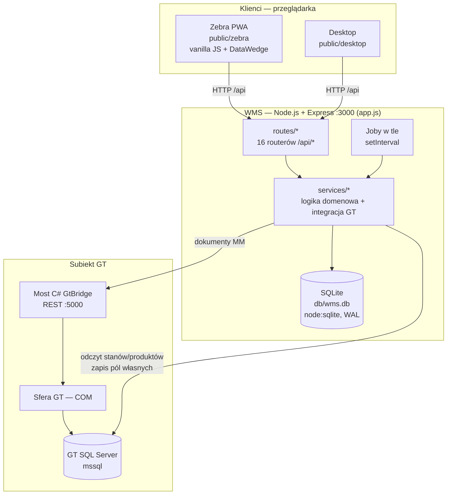
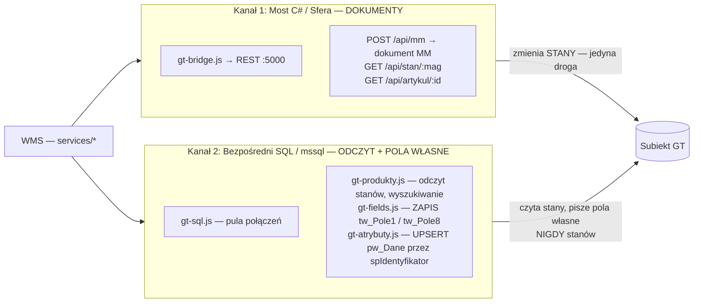
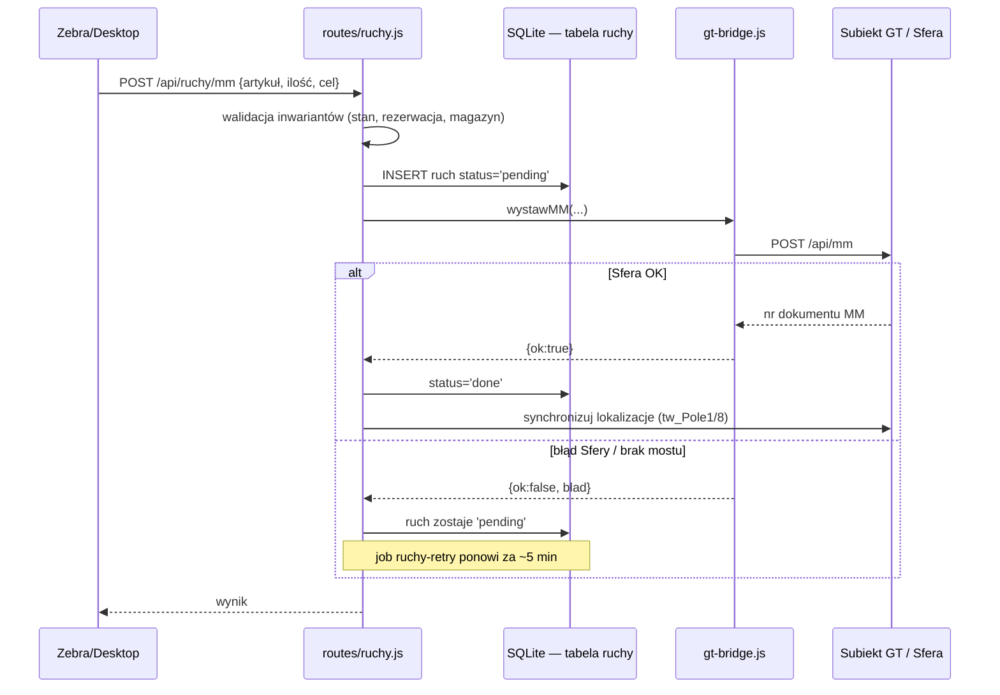

# Architektura WMS

Lekki WMS jako uzupełnienie Subiekt GT — obsługuje lokalizacje magazynowe, przesunięcia MM
i parametry produktu. Zbiór i wysyłkę robi Sellasist. Ten dokument rysuje **jak to jest
poskładane**; reguły biznesowe (co wolno, a czego nie) są w [zasady.md](zasady.md), a pełny
kontekst dla agenta w [../CLAUDE.md](../CLAUDE.md).

> Diagramy są w mermaid — renderują się na GitHubie i w edytorach z podglądem mermaid
> (VS Code: rozszerzenie „Markdown Preview Mermaid Support").

---

## 1. Kontekst systemu

- **Frontend** to statyczne pliki serwowane przez Express (`app.js`, `express.static` z
  `Cache-Control: no-cache`). Zebra i Desktop to ta sama apka w dwóch layoutach. Brak frameworka
  i brak buildu — czysty HTML + vanilla JS. Skan na Zebrze wstrzykuje DataWedge do aktywnego
  `<input>` (patrz [zasady.md](zasady.md#skanowanie-datawedge)).
- **Backend** — Express montuje 16 routerów pod `/api/*`, logikę trzyma w `services/*`,
  stan lokalny w SQLite (wbudowany `node:sqlite`, tryb WAL, synchroniczny).
- **GT** — dwa niezależne kanały (sekcja 3).

## 2. Warstwy i moduły

| Warstwa | Gdzie | Rola |
|---|---|---|
| Klienci | `public/zebra`, `public/desktop` | UI; walidacja tylko dla UX, **nieautorytatywna** |
| Trasy | `routes/*` | HTTP `/api/*`, **egzekwują inwarianty** (jedyne źródło prawdy reguł) |
| Logika domenowa | `services/*` (bez `gt-*`) | rozbicie stanu, kanały rezerwacji, model lokalizacji, uzupełnienia, strefy |
| Integracja GT | `services/gt-*` | most C# + bezpośredni SQL do GT |
| Dane lokalne | `db/database.js`, `db/001_init.sql` | SQLite: lokalizacje, stany, ruchy, audyt |
| Joby | `services/*-job.js` i pokrewne | cykliczna synchronizacja (sekcja 5) |

**Trasy pogrupowane wg domeny** (montaż w `app.js`):

- **Ruch i lokalizacje:** `ruchy` (LOK/MM, kolejka `pending`), `lokalizacje` (dom K4, skan, model kodu)
- **Rozkładanie dostaw/zwrotów:** `zwroty`, `dostawy`, `uzupelnienia`, `do-sprawdzenia`
- **Obchody magazynu:** `sciezki` (Ostatnie sztuki / K4 rezerwacja / Czyść zera / Brak parametrów)
- **Produkt i stany:** `produkty` (parametry → pola własne), `magazyny`, `zestawienia`
- **Panel/nadzór:** `pulpit`, `rozjazdy`, `audyt`, `status`
- **Dostęp:** `uzytkownicy` (logowanie), `blokady` (blokada edycji)

**Kluczowe serwisy domenowe** (pełna lista w `services/`):
`lokalizacje-model` (`rozbierzKod` → hala/regał/typ), `rozbicie-stanu` i `do-rozlozenia`
(kubełki rozkładania), `kanaly` (rozbicie rezerwacji na kanały), `adnotacja-stref`
(dopisek `+StD`/`+StZ`), `wozek-model`, `wyszukiwanie`, `uzupelnienia`.

## 3. Integracja z GT — dwa kanały

To jest sedno architektury. **Stany zmienia się TYLKO dokumentem przez Sferę; pola własne
pisze się bezpośrednim SQL-em. Nigdy odwrotnie.**

**Kanał 1 — Most C# (`services/gt-bridge.js`, domyślnie `http://localhost:5000`).**
Wystawia dokumenty MM przez Sferę GT (COM). To **jedyna** droga, którą WMS zmienia stany.
Klient mostu nigdy nie rzuca na błędzie sieci/HTTP — zwraca `{ok, status, dane, blad}`, żeby
trasa mogła zostawić ruch w kolejce jako `pending` (sekcja 4). Adres nadpisywalny przez
`GT_BRIDGE_URL` (w konfiguracji testowej celowo wskazuje martwy port, żeby nie wystawić MM).

**Kanał 2 — Bezpośredni SQL (`services/gt-sql.js`, `mssql`).**
Czyta stany i kartotekę (`gt-produkty.js`) oraz **pisze pola własne**:
- `gt-fields.js` → `UPDATE tw__Towar.tw_Pole1 / tw_Pole8` (lokalizacje K4 / K4G),
- `gt-atrybuty.js` → `UPSERT pw_Dane` (wymiary, wagi) z alokacją `pwd_Id` przez procedurę
  `spIdentyfikator` (**nigdy `MAX(pwd_Id)+1`** — to psuło licznik GT, patrz [zasady.md](zasady.md#pola-własne-gt)).

> ⚠️ Nagłówek w `gt-sql.js` mówi „tylko do odczytu" — to nieaktualne. Bezpośredni SQL **pisze**
> pola własne (lokalizacje, parametry). Nie pisze **nigdy** stanów ilościowych. Most-owy stub
> `ZapiszLokalizacjeAsync` jest niepodłączony — pola własne idą wyłącznie kanałem 2.

## 4. Przepływ ruchu (kolejka `pending`)

Każdy ruch najpierw ląduje w SQLite ze statusem `pending`, dopiero potem woła most. Przy błędzie
Sfery ruch **zostaje** `pending` i czeka na retry — nie ginie.

Walidacja inwariantów (ilość ≤ stan lokalizacji, cel w innym magazynie, ilość ≤ stan GT −
rezerwacja itd.) dzieje się **w trasie, przed** zapisem — pełna lista w
[zasady.md](zasady.md#inwarianty). Front waliduje te same reguły tylko dla szybkiego feedbacku.

## 5. Joby w tle

Startowane w `app.js` (linie 89–96). Interwały nadpisywalne z `.env`.

| Job | Plik | Interwał | Co robi | Pisze do GT? |
|---|---|---|---|---|
| Retry ruchów | `ruchy-retry.js` | 5 min | ponawia MM w statusie `pending` | tak (most) |
| Rozjazdy | `rozjazdy.js` | 10 min · `ROZJAZDY_INTERWAL_MIN` | detekcja GT↔WMS; auto-korekta K4 (1 lok.) | kopia WMS |
| Strefy w GT | `strefy-w-gt-job.js` | 10 min · `WMS_STREFY_INTERWAL_MIN` | dopisek stref do `tw_Pole1` (tylko przy zmianie) | tak (`tw_Pole1`) |
| Rozmontowania | `rozmontowania.js` | 10 min · `WMS_ROZMONTOWANIA_INTERWAL_MIN` | auto-dopis rozmontowań zestawów | — |
| Waga gabarytowa | `waga-gabarytowa-job.js` | 6 h · `WAGA_GAB_INTERWAL_MIN` | przelicza wagę gab. po ręcznej zmianie wymiarów w Subiekcie | tak (`pw_Dane`) |
| Reconciliacja MM | `reconciliacja-mm.js` | 1 h | uzgadnia MM wystawione mostem z GT | odczyt |
| Snapshot pulpitu | `pulpit-snapshot.js` | 1 h | migawka statusów dla dashboardu | — (SQLite) |
| Backup | `backup.js` | co godz. 7–20 + 2:00 | kopia `wms.db`, rotacja dziadek-ojciec-syn | — (lokalny, `WMS_BACKUP_DISABLED`) |

Joby podpisują wpisy audytu jako `system:<job>` i są domyślnie ukryte w Logu zmian
(rozpoznanie po prefiksie użytkownika — patrz [zasady.md](zasady.md#log-zmian-audyt)).

## 6. Model danych (SQLite)

Schemat w `db/001_init.sql`, migracje inline w `db/database.js` (dodają kolumny przy starcie,
gdy brakuje).

| Tabela | Rola |
|---|---|
| `lokalizacje` | katalog miejsc K4/K4G; cechy (`hala`/`regal`/`typ`) liczone z kodu przez `lokalizacje-model.js` |
| `stany_lokalizacji` | ile czego leży na danej lokalizacji (**kopia** — GT jest master stanów) + `artykul_ean` |
| `ruchy` | kolejka ruchów LOK/MM ze statusem; kolumny źródła: `mag_zrodlo_zewnetrzny`, `mag_zrodlo_pula`, `zrodlo_dok` |
| `rozjazdy` | wykryte rozbieżności GT vs WMS do decyzji magazyniera |
| `audyt` | log zdarzeń (sprawdzenia ścieżek, zmiany, akcje jobów) |

Pola po stronie GT, którymi zarządza WMS (kopie do wyświetlenia): `tw_Pole1` (miejsce K4),
`tw_Pole8` (lokalizacje K4G), `pw_Dane` (wymiary/wagi). Szczegóły i „kto pisze" —
[zasady.md](zasady.md#pola-własne-gt).

## 7. Uwierzytelnianie i dostęp

- `POST/PUT/DELETE` wymagają sesji (`auth.wymagajSesjiNaZapisie`) — middleware **wstrzykuje
  operatora z tokenu do `req.body`**, więc handlery nie muszą znać „kto". `GET` jest otwarty.
- Rola `uczeń` ma zawężony dostęp (`auth.blokujUcznia(...)`) — m.in. tylko zwroty i wybrane
  ścieżki; ścieżka „Czyść zera" jest przed nim ukryta (jako jedyna kasuje dane).
- Blokada edycji (`services/blokady.js`, `blokady.middlewareRuch`) — twarda blokada na desktopie.

## 8. Uruchomienie

`node app.js` → serwer na `:3000`, `/` przekierowuje do Zebry (`/zebra/ruch.html`).
Na macOS: `start-wms.command` / `stop-wms.command`. Konfiguracja GT (host/port/hasło SQL,
adres mostu) w `.env` (poza repo; wzór w `.env.example`).

> Uwaga przy lokalnym uruchamianiu do testów: joby z tabeli w sekcji 5 **piszą do GT** (kanał 2
> pisze pola własne, most wystawia MM). Konfiguracja testowa neutralizuje most (`GT_BRIDGE_URL`
> na martwy port) i backup (`WMS_BACKUP_DISABLED=1`), ale bezpośredni SQL nadal celuje w bazę
> z `.env`. Szczegóły w `MEMORY.md` → „MINA: testowy pisze do produkcji".
