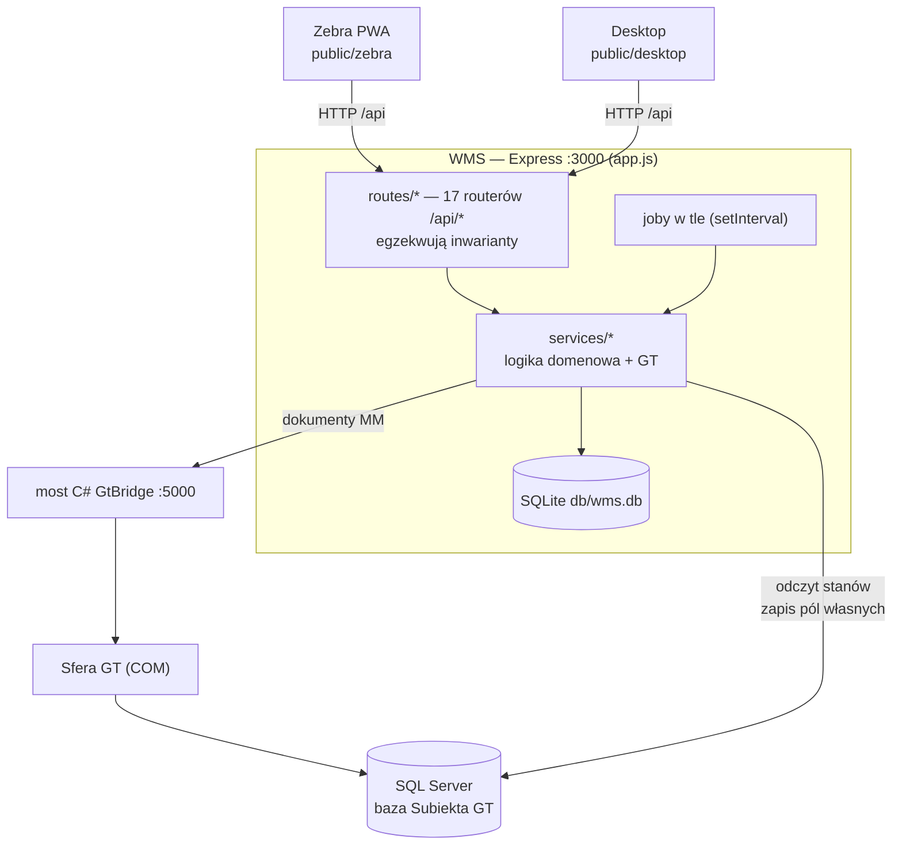

# WMS — opis i założenia

Co to za system, z czego jest zbudowany i jak w nim pracujemy.
Głębiej: [architektura.md](architektura.md) (diagramy), [zasady.md](zasady.md)
(reguły per element), [../CLAUDE.md](../CLAUDE.md) (pełny kontekst i uzasadnienia
decyzji — **źródło prawdy**, gdy dokumenty się rozjadą).

---

## 1. Założenia

- **Nakładka na Subiekt GT, nie zamiennik.** WMS obsługuje wyłącznie lokalizacje, przesunięcia MM
  i parametry produktu (wymiary/wagi).
- **GT = master stanów ilościowych.** WMS nigdy nie zmienia stanu bezpośrednio — tylko dokumentem
  przez Sferę. Jeśli liczby się nie zgadzają, rację ma Subiekt.
- **WMS = master lokalizacji.** Pola własne w GT to kopia do wyświetlenia dla człowieka.
- **Backend = jedyne źródło prawdy inwariantów.** Walidacja we froncie jest tylko dla UX;
  każda reguła musi być w `routes/`, bo drugi klient albo gołe API ją ominie.
- **Nic nie ginie.** Ruch zapisuje się do tabeli `ruchy` jako `pending` **zanim** zawoła most;
  błąd Sfery → zostaje `pending`, a retry job próbuje dalej.
- **Magazynier ma rację, automat nie.** Reguły są tak ustawione, żeby automat nie kasował danych
  na podstawie samego stanu (zero na półce ≠ „towaru tu nie ma"). Dane kasuje człowiek stojący
  przy regale, w wyznaczonym do tego miejscu.

## 2. Technologia

| Warstwa | Co |
|---|---|
| Backend | Node.js **≥ 22.5** + Express 4. Zależności: `express`, `mssql`, `dotenv` — tyle. |
| Baza | SQLite przez **wbudowany `node:sqlite`** (synchroniczny, WAL), plik `db/wms.db` |
| Frontend | czysty HTML + vanilla JS, **bez frameworka i bez buildu**; `public/zebra` (terminal, viewport 360×640) i `public/desktop` — ta sama apka, dwa layouty |
| Skanowanie | DataWedge wstrzykuje skan do aktywnego `<input>` + Enter |
| Integracja GT | (1) most C# `bridge/GtBridge` (.NET 8, win-x86) → Sfera → REST `:5000` — **dokumenty MM**; (2) bezpośredni SQL do bazy GT przez `mssql` — **odczyt stanów + zapis pól własnych** |
| Testy | `npm test` (`node --test`) — czysta logika domenowa, bez SQLite i bez GT |
| Produkcja | pecet z Windows (ten sam, co Subiekt): Node + most + tray jako Scheduled Tasks; dostęp po LAN i Tailscale |

## 3. Schemat



**Dwa niezależne kanały do GT** — to najważniejsza rzecz na tym rysunku. Wszystko, co **zmienia
stan**, idzie przez most i Sferę (dokument MM). Wszystko, co tylko **czyta** albo dopisuje adres
do kartoteki, idzie bezpośrednim SQL-em. Most bywa niedostępny (Sfera potrafi się zawiesić) —
wtedy odczyty działają dalej, a ruchy czekają w kolejce jako `pending`.

**Joby w tle** (start na końcu `app.js`): retry ruchów, wykrywanie rozjazdów GT↔WMS (10 min),
dopisywanie stref do pola `tw_Pole1` (10 min), waga gabarytowa (6 h), rozmontowania,
rekonsyliacja MM, snapshot pulpitu, dzienny backup do chmury.

## 4. Co jest w aplikacji

**Zebra** (`public/zebra`, wszystko jako SPA w `ruch.html`):
Ruch towaru (MM / zmiana lokalizacji) · Uzupełnienia K4 · Dostawy do rozłożenia ·
Ścieżki (obchody + zwroty) · Przyjęcia (PW, przywózki, „do sprawdzenia") · Historia ruchów ·
Parametry produktu (wymiary/wagi).

**Desktop** (`public/desktop`): Pulpit · Produkty · Rozjazdy · Lokalizacje · Przesunięcia MM ·
Uzupełnienia · Zwroty · Dostawy · Do sprawdzenia · Zestawienia · Raporty · Log zmian ·
Użytkownicy · Kartony wysyłkowe.

## 5. Bezpieczeństwo

**Model:** aplikacja wewnętrzna, w sieci lokalnej magazynu (plus Tailscale zdalnie).
Nie jest wystawiona do internetu i nie jest na to przygotowana.

- **Sesje:** token `crypto.randomBytes(24)` w tabeli `sesje`, przekazywany nagłówkiem
  `x-wms-token`, wygasa po **12 h bezczynności**. Front trzyma go w `localStorage`,
  a `public/shared/auth.js` patchuje `window.fetch`, więc każde istniejące zapytanie niesie
  token bez zmian w kodzie ekranów.
- **PIN opcjonalny:** scrypt + losowa sól, porównanie `timingSafeEqual`, 4–8 cyfr.
  Profil bez PIN-u loguje się jednym tapnięciem (świadomie — magazyn, rękawice, terminal).
- **Role:** `admin` (użytkownicy, kartony) · `magazynier` · `uczen` (tylko Ścieżki + zwroty,
  `auth.blokujUcznia`; ścieżka „Czyść zera" jest przed nim ukryta, bo jako jedyna kasuje dane).
- **Zapisy (POST/PUT/DELETE) wymagają sesji**, a middleware **wstrzykuje operatora z tokenu**
  do `req.body.operator`, nadpisując to, co przysłał klient — „kto to zrobił" nie pochodzi
  z pola tekstowego. **GET-y są otwarte** (odczyt stanów, skany) — decyzja świadoma.
- **Audyt:** tabela `audyt` (kto, co, kiedy, przed/po). Joby podpisują się `system:<job>`
  i są domyślnie ukryte w Logu zmian.
- **Backup:** dzienna paczka `.db` + 3 czytelne CSV → `rclone copy` do Backblaze B2
  z Object Lock 30 dni (jednokierunkowo, więc ransomware na pececie nie skasuje kopii).
- **Znane luki (świadome, nie przeoczone):** brak HTTPS · brak limitu prób logowania ·
  brak `helmet`/CORS · baza GT czytana kontem `sa` zamiast konta read-only · pierwszy start
  seeduje użytkownika `Admin` bez PIN-u.

## 6. Co jest wymagane do zalogowania

Nie ma haseł ani e-maili. Logowanie = **wybór profilu z listy** + opcjonalny PIN.

1. `GET /api/uzytkownicy/profile` — lista aktywnych profili (bez auth, zasila ekran wyboru).
2. `POST /api/uzytkownicy/login {id | imie, pin?}` → `{token, uzytkownik}`.
   Profil z PIN-em bez podanego PIN-u dostaje `401 {wymaga_pin: true}`.
3. Front zapisuje token i dokleja go nagłówkiem `x-wms-token` do wszystkiego pod `/api/`.
4. `GET /api/uzytkownicy/ja` odtwarza sesję po odświeżeniu strony;
   `POST /api/uzytkownicy/logout` ją kończy.

**Pierwsze uruchomienie na czystej bazie:** kod seeduje użytkownika **`Admin`** (rola `admin`,
bez PIN-u) — wchodzisz i zakładasz resztę w panelu admina. Same odczyty (GET) działają bez
logowania, więc apkę da się przeglądać przed zalogowaniem.

## 7. Repozytorium, uruchomienie, wdrożenie

- **Git:** `git@github.com:kaziueee/was.git` → https://github.com/kaziueee/was *(prywatne — dostęp
  nadaje właściciel repo: collaborator + klucz SSH)*
- Most C# mieszka w tym samym repo (`bridge/GtBridge`).

```bash
npm install
cp .env.example .env   # uzupełnić GT_SQL_* (hasła nie ma w repo) i GT_BRIDGE_URL
npm test
node app.js            # :3000, / → /zebra/ruch.html
```

**Wdrożenie na produkcję** = `git push`, a na pececie dwuklik `aktualizuj-wms.cmd`
(pull + `npm ci` + restart usługi) albo `aktualizuj-most.cmd` (pull + build + restart mostu).
Serwer i most chodzą jako Scheduled Tasks, most ma ikonę w trayu.

> ⚠️ **Mina przy lokalnym uruchomieniu:** joby w tle **piszą do GT** (kanał SQL zapisuje pola
> własne, most wystawia MM). Do testów: `GT_BRIDGE_URL` na martwy port, `WMS_BACKUP_DISABLED=1`,
> `WMS_TESTOWY=1` (szary pasek „TESTOWY" w UI). Bezpośredni SQL i tak celuje w bazę z `.env` —
> upewnij się, że to baza testowa, a nie produkcyjna.

## 8. Jak tu pracujemy — konwencje

- **Kod i komentarze po polsku** (bez ogonków w identyfikatorach): `synchronizujLokalizacje`,
  `pobierzStanyGt`. Trzymaj się tego — mieszanka języków w tej domenie robi bałagan.
- **Komentarz tłumaczy „dlaczego", nie „co".** Sporo reguł tutaj wygląda na dziwactwo, dopóki
  nie zna się przypadku z magazynu, który je wymusił — dlatego przy nieoczywistych miejscach
  stoi opis incydentu. Nie kasuj tych komentarzy przy refaktorze.
- **Nowa reguła biznesowa zawsze najpierw w `routes/`.** Front dokłada się tylko dla wygody.
- **Czysta logika do osobnego pliku w `services/`** (np. `kolejnosc-obchodu.js`,
  `adnotacja-stref.js`) — dzięki temu da się ją przetestować bez SQLite i bez GT.
- **Bez buildu i bez frameworka we froncie** — plik na serwerze to plik w przeglądarce.
  Statyki lecą z `Cache-Control: no-cache`, więc terminal dostaje świeżą wersję po odświeżeniu.
- **`CLAUDE.md` to dziennik decyzji projektu.** Zmieniasz regułę — dopisujesz tam dlaczego.
